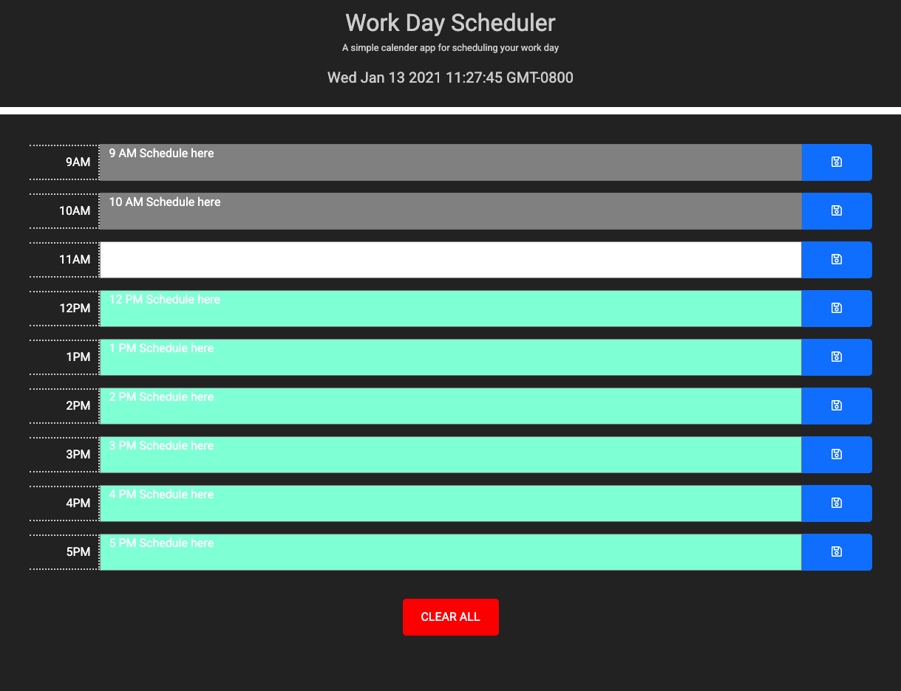
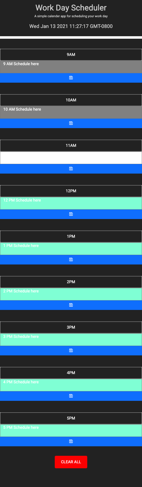

# hw5-thirdPartyAPI

## Links to webpage!
[Link to Scheduler](https://sksmejn.github.io/hw5-thirdPartyAPI/)

## Info
A work hour scheduler. In the header, a current time clock is shown and updated every second. The hours of 9-5 (common work hours) is shown below. Users can write whatever they need to in the provided field then save those items to localstorage so the items persists upon reloading page. The text field changes color depending if the hour is current, past or future. A red clear button clears text field and localstorage just in case your schedule goes haywire.

## Screenshot of webpage on big screens

## Screenshot of webpage on smaller screens

